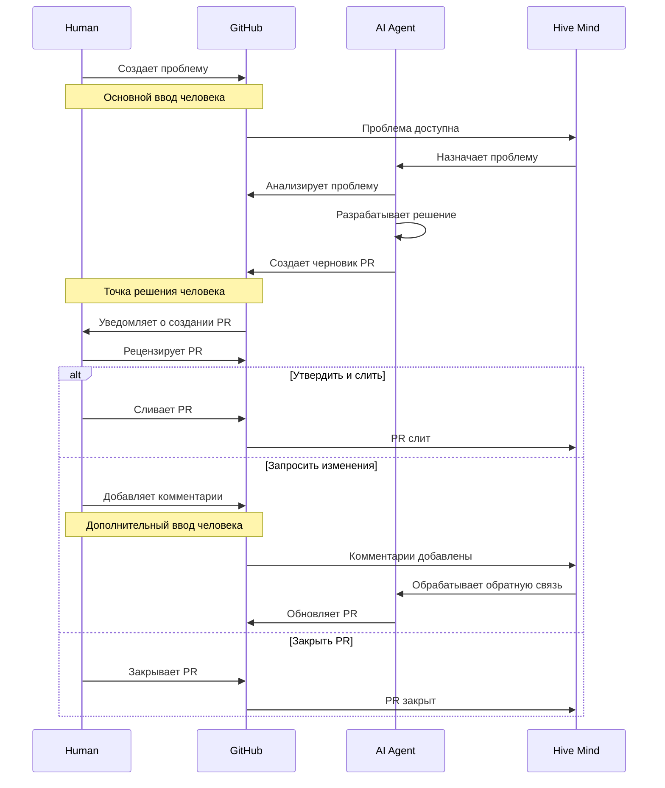
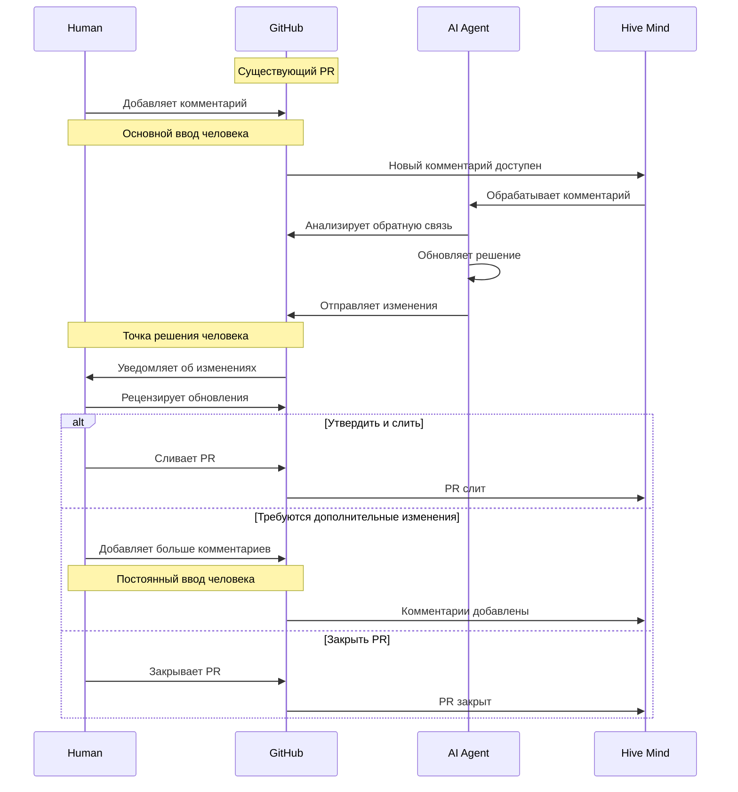

[](https://npmjs.com/@deep-assistant/hive-mind)
[](https://github.com/deep-assistant/hive-mind/blob/main/LICENSE)
[](https://github.com/deep-assistant/hive-mind/stargazers)

[](https://gitpod.io/#https://github.com/deep-assistant/hive-mind)
[](https://github.com/codespaces/new?hide_repo_select=true&ref=main&repo=deep-assistant/hive-mind)

# Hive Mind 🧠

**Главный ум ИИ, который управляет ульем ИИ.** Оркестратор ИИ, который управляет другими ИИ. HIVE MIND. SWARM MIND.

Также возможно подключить этот ИИ к коллективному человеческому интеллекту, что означает, что эта система может общаться с людьми для получения требований, экспертизы и обратной связи.

[](https://github.com/konard/problem-solving)

Вдохновлено [konard/problem-solving](https://github.com/konard/problem-solving)

## ⚠️ ПРЕДУПРЕЖДЕНИЕ

Запуск этого программного обеспечения на вашей машине разработчика НЕБЕЗОПАСЕН.

Рекомендуется использовать ОТДЕЛЬНУЮ установку Ubuntu 24.04 (скрипт установки подготовлен для вас).

Это программное обеспечение использует полный автономный режим Claude Code, что означает, что оно свободно выполнять любые команды, которые оно считает необходимыми.

Это может привести к неожиданным побочным эффектам.

Также известна проблема утечки дискового пространства. Поэтому убедитесь, что вы можете переустановить виртуальную машину для очистки пространства и/или устранения любых повреждений виртуальной машины.

### ⚠️ КРИТИЧЕСКОЕ: Безопасность токенов и конфиденциальных данных

**ЭТО ПРОГРАММНОЕ ОБЕСПЕЧЕНИЕ НЕ МОЖЕТ ГАРАНТИРОВАТЬ НИКАКУЮ БЕЗОПАСНОСТЬ ДЛЯ ВАШИХ ТОКЕНОВ ИЛИ ДРУГИХ КОНФИДЕНЦИАЛЬНЫХ ДАННЫХ НА ВИРТУАЛЬНОЙ МАШИНЕ.**

Существует бесчисленное количество способов извлечения токенов из виртуальной машины, подключенной к интернету. Это включает, но не ограничивается:

- **Claude MAX токены** - требуются для работы ИИ
- **Токены GitHub** - требуются для доступа к репозиториям
- **Ключи API и учетные данные** - любые конфиденциальные данные в системе

**ВАЖНЫЕ СООБРАЖЕНИЯ БЕЗОПАСНОСТИ:**

- Запуск на машине разработчика **АБСОЛЮТНО НЕБЕЗОПАСЕН**
- Запуск на виртуальной машине **МЕНЕЕ НЕБЕЗОПАСЕН**, но все еще имеет риски
- Даже если данные вашей машины разработчика не подвергаются прямому воздействию, виртуальная машина все равно содержит конфиденциальные токены
- Любой токен, хранящийся в системе, подключенной к интернету, может быть потенциально скомпрометирован

**ИСПОЛЬЗУЙТЕ ЭТО ПРОГРАММНОЕ ОБЕСПЕЧЕНИЕ ПОЛНОСТЬЮ НА СВОЙ РИСК И ОТВЕТСТВЕННОСТЬ.**

Мы настоятельно рекомендуем:
- Использовать выделенные изолированные виртуальные машины
- Регулярно ротировать токены
- Контролировать использование токенов на предмет подозрительной деятельности
- Никогда не использовать производственные токены или учетные данные
- Быть готовым отозвать и заменить все токены, используемые с этой системой

Минимальные требования к системе для запуска `hive.mjs`:
```
1 ядро CPU
1 ГБ RAM
> 2 ГБ SWAP
50 ГБ дискового пространства
```

## 🚀 Быстрый старт

### Глобальная установка

#### Использование Bun (рекомендуется)
```bash
bun install -g @deep-assistant/hive-mind
```

#### Использование Node.js
```bash
npm install -g @deep-assistant/hive-mind
```

### Docker установка

Запустите Hive Mind с помощью Docker для более безопасной локальной установки - никаких ручных настроек не требуется:

**Примечание:** Docker намного безопаснее для локальной установки и может использоваться для установки нескольких изолированных экземпляров на сервере или кластере Kubernetes. Для развертываний Kubernetes см. раздел [Установка Helm (Kubernetes)](#установка-helm-kubernetes) ниже.

```bash
# Загрузите последний образ из Docker Hub
docker pull konard/hive-mind:latest

# Запустите интерактивный сеанс
docker run -it konard/hive-mind:latest

# ВАЖНО: Аутентифицируйтесь ПОСЛЕ установки образа Docker
# Это избегает истечения времени ожидания при сборке и позволяет установке завершиться успешно

# Внутри контейнера аутентифицируйтесь с помощью GitHub
gh auth login -h github.com -s repo,workflow,user,read:org,gist

# Настройте git с помощью учетной записи из инструмента gh
USERNAME=$(gh api user --jq '.login')
EMAIL=$(gh api user/emails --jq '.[] | select(.primary==true) | .email')

git config --global user.name "$USERNAME"
git config --global user.email "$EMAIL"

echo "Git настроен:"
git config --global user.name
git config --global user.email

# Аутентифицируйтесь с Claude
claude

# Теперь вы можете использовать hive и solve команды
solve https://github.com/owner/repo/issues/123
```

**Преимущества Docker:**
- ✅ Предварительно настроенная среда Ubuntu 24.04
- ✅ Все зависимости предустановлены
- ✅ Изолировано от вашей хост-системы
- ✅ Легко запустить несколько экземпляров с разными учетными записями GitHub
- ✅ Согласованная среда на разных машинах

См. [docs/DOCKER.md](./docs/DOCKER.md) для расширенного использования Docker.

### Helm установка (Kubernetes)

Разверните Hive Mind на Kubernetes с помощью Helm:

```bash
# Добавьте репозиторий Helm для Hive Mind
helm repo add link-assistant https://link-assistant.github.io/hive-mind
helm repo update

# Установите Hive Mind
helm install hive-mind link-assistant/hive-mind

# Или установите с пользовательскими значениями
helm install hive-mind link-assistant/hive-mind -f values.yaml
```

**Преимущества Helm:**
- ✅ Простое развертывание на кластерах Kubernetes
- ✅ Декларативное управление конфигурацией
- ✅ Простые обновления и откаты
- ✅ Готово для production с настраиваемыми ресурсами
- ✅ Поддерживает несколько реплик и масштабирование

См. [docs/HELM.md](./docs/HELM.md) для подробных опций конфигурации Helm.

**Примечание:** Диаграмма Helm опубликована на [ArtifactHub](https://artifacthub.io/packages/helm/link-assistant/hive-mind) для удобного поиска.

### Установка на сервере Ubuntu 24.04

1. Переустановите/установите сервер VPS/VDS с чистой Ubuntu 24.04
2. Войдите как пользователь `root`.
3. Выполните скрипт основной установки
   ```bash
   curl -fsSL -o- https://github.com/deep-assistant/hive-mind/raw/refs/heads/main/scripts/ubuntu-24-server-install.sh | bash
   ```
   **Примечание:** Скрипт установки НЕ запустит `gh auth login` автоматически. Это сделано специально для поддержки сборок Docker без истечения времени ожидания. Аутентификация выполняется на следующих шагах.

4. Войдите как пользователь `hive`
   ```bash
   su - hive
   ```

5. **ВАЖНО:** Аутентифицируйтесь с помощью GitHub CLI ПОСЛЕ завершения установки
   ```bash
   gh auth login -h github.com -s repo,workflow,user,read:org,gist

   USERNAME=$(gh api user --jq '.login')
   EMAIL=$(gh api user/emails --jq '.[] | select(.primary==true) | .email')

   git config --global user.name "$USERNAME"
   git config --global user.email "$EMAIL"

   echo "Git настроен:"
   git config --global user.name
   git config --global user.email
   ```
   Примечание: Следуйте подсказкам для аутентификации с вашей учетной записью GitHub. Это необходимо для работы инструмента gh, и система будет выполнять все действия с помощью этой учетной записи GitHub. Этот шаг должен быть выполнен ПОСЛЕ завершения скрипта установки, чтобы избежать истечения времени ожидания при сборке в средах Docker.

6. Claude Code CLI, OpenCode AI CLI и @link-assistant/agent предустановлены в предыдущем скрипте. Теперь убедитесь, что claude авторизован. Выполните команду claude и следуйте всем шагам для авторизации локального claude
   ```bash
   claude
   ```

   Примечание: Оба opencode и agent поставляются с бесплатной моделью Grok Code Fast 1 по умолчанию - поэтому авторизация не требуется для этих инструментов.

7. Запустите бота Telegram для Hive Mind:

   **Использование нотации Links (рекомендуется):**
   ```
   screen -S bot # Введите новый экран для бота

   hive-telegram-bot --configuration "
     TELEGRAM_BOT_TOKEN: '849...355:AAG...rgk_YZk...aPU'
     TELEGRAM_ALLOWED_CHATS:
       -1002975819706
       -1002861722681
     TELEGRAM_HIVE_OVERRIDES:
       --all-issues
       --once
       --auto-fork
       --skip-issues-with-prs
       --attach-logs
       --verbose
       --no-tool-check
       --prefix-fork-name-with-owner-name
     TELEGRAM_SOLVE_OVERRIDES:
       --auto-fork
       --auto-continue
       --attach-logs
       --verbose
       --no-tool-check
       --prefix-fork-name-with-owner-name
     TELEGRAM_BOT_VERBOSE: true
   "

   # Нажмите CTRL + A + D для отсоединения от экрана
   ```

   **Использование отдельных опций командной строки:**
   ```
   screen -S bot # Введите новый экран для бота

   hive-telegram-bot --token 849...355:AAG...rgk_YZk...aPU --allowed-chats "(
     -1002975819706
     -1002861722681
   )" --hive-overrides "(
     --all-issues
     --once
     --auto-fork
     --skip-issues-with-prs
     --attach-logs
     --verbose
     --no-tool-check
     --prefix-fork-name-with-owner-name
   )" --solve-overrides "(
     --auto-fork
     --auto-continue
     --attach-logs
     --verbose
     --no-tool-check
     --prefix-fork-name-with-owner-name
   )" --verbose

   # Нажмите CTRL + A + D для отсоединения от экрана
   ```

   Примечание: Вам может потребоваться зарегистрировать свой собственный бот на https://t.me/BotFather, чтобы получить токен бота.


#### Вход в Codex

1. Подключитесь к вашему экземпляру VPS с установленным Hive Mind, используя SSH с открытым туннелем
```bash
ssh -L 1455:localhost:1455 root@123.123.123.123
```

2. Запустите сервер oAuth для входа в codex:

```bash
codex login
```
Сервер callback oAuth на порту 1455 будет запущен, и будет напечатана ссылка на oAuth, скопируйте ссылку.

3. Используйте браузер на машине, с которой вы запустили туннель, вставьте там ссылку из команды `codex login` и перейдите туда. После перенаправления на localhost:1455 вы увидите страницу успешного входа, и в `codex login` вы увидите `Successfully logged in`. После этого команда `codex login` завершится, и вы можете использовать команду `codex` как обычно для проверки. Она также должна работать с `--tool codex` в командах `solve` и `hive`.

### Основные операции
```bash
# Решайте с максимальной мощью
solve https://github.com/Veronika89-lang/index.html/issues/1 --auto-continue --attach-logs --verbose --model opus --auto-fork --think max

# Автоматически решайте проблемы GitHub (auto-fork если нет доступа на запись)
solve https://github.com/owner/repo/issues/123 --auto-fork --model sonnet

# Решите проблему с PR на пользовательскую ветвь (режим ручного fork)
solve https://github.com/owner/repo/issues/123 --base-branch develop --fork

# Продолжите работу над существующим PR
solve https://github.com/owner/repo/pull/456 --model opus

# Возобновите из сеанса Claude при достижении лимита
solve https://github.com/owner/repo/issues/123 --resume session-id

# Запустите оркестрацию hive (контролируйте и решайте проблемы автоматически)
hive https://github.com/owner/repo --monitor-tag "help wanted" --concurrency 3

# Контролируйте все проблемы в организации с auto-fork
hive https://github.com/microsoft --all-issues --max-issues 10 --auto-fork

# Запустите процесс совместного рецензирования
review --repo owner/repo --pr 456

# Несколько рецензентов ИИ для консенсуса
./reviewers-hive.mjs --agents 3 --consensus-threshold 0.8
```

## 📋 Основные компоненты

| Скрипт | Назначение | Ключевые особенности |
|--------|-----------|----------------------|
| `solve.mjs` (stable) | Решатель проблем GitHub | Auto fork, создание ветвей, генерация PR, возобновление сеансов, поддержка fork |
| `hive.mjs` (stable) | Оркестрация и мониторинг ИИ | Мониторинг нескольких репозиториев, параллельные рабочие, управление очередью проблем |
| `review.mjs` (alpha) | Автоматизация проверки кода | Совместные проверки ИИ, автоматизированная обратная связь |
| `reviewers-hive.mjs` (alpha / experimental) | Управление командой рецензентов | Консенсус мультиагентов, назначение рецензентов |
| `telegram-bot.mjs` (stable) | Интерфейс бота Telegram | Удаленное выполнение команд, поддержка группового чата, диагностические инструменты |

## 🔧 Опции solve

```bash
solve <issue-url> [options]

  --model, -m           Модель (sonnet, opus для claude; grok-code-fast-1, gpt4o для opencode; gpt5, gpt5-codex, o3 для codex; grok, sonnet, haiku для agent)
                        [default: sonnet для claude, grok-code-fast-1 для opencode, gpt-5 для codex, grok-code-fast-1 для agent]
  --tool                Инструмент ИИ (claude, opencode, codex, agent)    [default: claude]
  --fork, -f            Создайте fork репозитория если нет доступа на запись         [default: false]
  --auto-fork           Автоматически создавайте fork открытых репозиториев без доступа на запись (не удается для приватных)
                        [default: false]
  --base-branch, -b     Целевая ветвь для PR                 [default: ветвь по умолчанию репо]
  --resume, -r          Возобновите с ID сеанса
  --verbose, -v         Включите подробное логирование               [default: false]
  --dry-run, -n         Подготовьте только, не выполняйте          [default: false]
  --only-prepare-command  Только подготовьте и выведите команду [default: false]
  --skip-tool-check     Пропустите проверку подключения инструмента (используйте --no-tool-check для отключения)
                        [default: false]
  --auto-pull-request-creation  Создайте черновик PR перед выполнением [default: true]
  --attach-logs         Приложите логи к PR (⚠️ чувствительно)    [default: false]
  --auto-close-pull-request-on-fail  Закройте PR при сбое        [default: false]
  --auto-continue       Продолжите с существующим PR когда предоставлен URL проблемы
                        [default: false]
  --auto-continue-limit, -c  Автоматическое продолжение при сбросе лимита [default: false]
  --auto-resume-on-errors  Автоматическое возобновление при сетевых ошибках (503 и т.д.)
                        [default: false]
  --auto-continue-only-on-new-comments  Сбой если нет новых комментариев
                        [default: false]
  --auto-commit-uncommitted-changes  Автоматически коммитьте изменения    [default: false]
  --auto-merge-default-branch-to-pull-request-branch  Слияние ветви по умолчанию в ветвь PR
                        (только в режиме продолжения) [default: false]
  --allow-fork-divergence-resolution-using-force-push-with-lease
                        Позволяйте force-push с --force-with-lease при расхождении fork
                        (ОПАСНО: может перезаписать историю fork) [default: false]
  --prefix-fork-name-with-owner-name  Префикс имени fork с владельцем (owner-repo)
                        Полезно для создания fork репозиториев с одинаковым именем от разных владельцев
                        [default: true]
  --continue-only-on-feedback  Продолжайте только если обнаружена обратная связь
                        [default: false]
  --watch, -w           Контролируйте обратную связь и автоматически перезапустите [default: false]
  --watch-interval      Интервал проверки обратной связи (секунды)    [default: 60]
  --min-disk-space      Минимальное дисковое пространство в МБ             [default: 500]
  --log-dir, -l         Каталог для файлов логов              [default: cwd]
  --think               Уровень мышления (low, medium, high, max)  [optional]
  --sentry              Включите отслеживание ошибок Sentry (используйте --no-sentry для отключения)
                        [default: true]
  --auto-cleanup        Удалите временный каталог при завершении
                        [default: true для приватных репо, false для открытых репо]
  --version             Показать номер версии
  --help, -h            Показать справку
```

## 🔧 Опции hive

```bash
hive <github-url> [options]

  --monitor-tag, -t     Метка для контроля                     [default: "help wanted"]
  --all-issues, -a      Контролируйте все проблемы (игнорируйте метки)   [default: false]
  --skip-issues-with-prs, -s  Пропустите проблемы с существующими PR [default: false]
  --concurrency, -c     Параллельные рабочие                     [default: 2]
  --pull-requests-per-issue, -p  Количество PR за проблему    [default: 1]
  --model, -m           Модель (opus, sonnet для claude; grok-code-fast-1, gpt4o для opencode; gpt5, gpt5-codex, o3 для codex; grok, sonnet, haiku для agent)
                        [default: sonnet для claude, grok-code-fast-1 для opencode, gpt-5 для codex, grok-code-fast-1 для agent]
  --tool                Инструмент ИИ (claude, opencode, codex, agent)    [default: claude]
  --interval, -i        Интервал опроса (секунды)              [default: 300]
  --max-issues          Ограничьте обработанные проблемы               [default: 0 (unlimited)]
  --once                Однократный запуск (не контролируйте)           [default: false]
  --dry-run             Выведите проблемы без обработки       [default: false]
  --skip-tool-check     Пропустите проверку подключения инструмента (используйте --no-tool-check для отключения)
                        [default: false]
  --verbose, -v         Включите подробное логирование               [default: false]
  --min-disk-space      Минимальное дисковое пространство в МБ             [default: 500]
  --auto-cleanup        Очистите /tmp/* /var/tmp/* при успехе   [default: false]
  --fork, -f            Создавайте fork репозиториев если нет доступа на запись        [default: false]
  --auto-fork           Автоматически создавайте fork открытых репозиториев без доступа на запись
                        [default: false]
  --attach-logs         Приложите логи к PR (⚠️ чувствительно)   [default: false]
  --project-number, -pn  Номер проекта GitHub для контроля
  --project-owner, -po  Владелец проекта GitHub (org или user)
  --project-status, -ps  Столбец статуса проекта для контроля    [default: "Ready"]
  --project-mode, -pm   Включите контроль на основе проекта      [default: false]
  --youtrack-mode       Включите режим YouTrack вместо GitHub  [default: false]
  --youtrack-stage      Переопределите этап YouTrack для контроля
  --youtrack-project    Переопределите код проекта YouTrack
  --target-branch, -tb  Целевая ветвь для pull requests      [default: ветвь по умолчанию репо]
  --log-dir, -l         Каталог для файлов логов              [default: cwd]
  --auto-continue       Передайте --auto-continue в solve для каждой проблемы
                        [default: false]
  --think               Уровень мышления (low, medium, high, max)  [optional]
  --sentry              Включите отслеживание ошибок Sentry (используйте --no-sentry для отключения)
                        [default: true]
  --watch, -w           Контролируйте обратную связь и автоматически перезапустите  [default: false]
  --issue-order, -o     Упорядочьте проблемы по дате (asc, desc)     [default: asc]
  --version             Показать номер версии
  --help, -h            Показать справку
```

## 🤖 Бот Telegram

Hive Mind включает интерфейс бота Telegram (SwarmMindBot) для удаленного выполнения команд.

### 🚀 Тестовый привод

Хотите увидеть Hive Mind в действии? Присоединитесь к нашему каналу Telegram, где вы можете выполнить Hive Mind на своих собственных проблемах и смотреть, как ИИ их решает:

**[Присоединитесь https://t.me/hive_mind_pull_requests](https://t.me/hive_mind_pull_requests)**

### Настройка

1. **Получите токен бота**
   - Поговорите с [@BotFather](https://t.me/BotFather) в Telegram
   - Создайте новый бот и получите свой токен
   - Добавьте бота в групповой чат и сделайте его администратором

2. **Настройте окружение**
   ```bash
   # Скопируйте пример конфигурации
   cp .env.example .env

   # Отредактируйте и добавьте свой токен бота
   echo "TELEGRAM_BOT_TOKEN=your_bot_token_here" >> .env

   # Опционально: ограничьте определенными чатами
   # Получите ID чата с помощью команды /help, затем добавьте:
   echo "TELEGRAM_ALLOWED_CHATS=123456789,987654321" >> .env
   ```

3. **Запустите бота**
   ```bash
   hive-telegram-bot
   ```

### Команды бота

Все команды работают только в **групповых чатах** (не в приватных сообщениях с ботом):

#### `/solve` - Решайте проблемы GitHub
```
/solve <github-url> [options]

Примеры:
/solve https://github.com/owner/repo/issues/123
/solve https://github.com/owner/repo/issues/123 --auto-fork --verbose
/solve https://github.com/owner/repo/issues/123 --auto-fork --auto-continue --attach-logs --verbose --model sonnet --think max
```

#### `/hive` - Запустите оркестрацию Hive
```
/hive <github-url> [options]

Примеры:
/hive https://github.com/owner/repo
/hive https://github.com/owner/repo --all-issues --max-issues 10
/hive https://github.com/microsoft --all-issues --concurrency 3
```

#### `/help` - Получите справку и диагностическую информацию
```
/help

Показывает:
- ID чата (необходимо для TELEGRAM_ALLOWED_CHATS)
- Тип чата
- Доступные команды
- Примеры использования
```

### Особенности

- ✅ **Только групповые чаты**: Команды работают только в групповых чатах (не приватные сообщения)
- ✅ **Полная поддержка опций**: Все опции командной строки работают в Telegram
- ✅ **Сеансы Screen**: Команды работают в отсоединенных сеансах screen
- ✅ **Ограничения чата**: Опциональный список разрешенных ID чатов
- ✅ **Диагностические инструменты**: Получите ID чата и информацию о конфигурации

### Примечания безопасности

- Работает только в групповых чатах, где бот администратор
- Опциональные ограничения ID чата через `TELEGRAM_ALLOWED_CHATS`
- Команды запускаются от пользователя системы, запустившего бота
- Убедитесь в правильной аутентификации (`gh auth login`, `claude-profiles`)

## 🏗️ Архитектура

Hive Mind работает на трех уровнях:

1. **Уровень оркестрации** (`hive.mjs`) - координирует несколько агентов ИИ
2. **Уровень выполнения** (`solve.mjs`, `review.mjs`) - выполняет конкретные задачи
3. **Уровень пользовательского интерфейса** - позволяет сотрудничество человека и ИИ

### Поток данных

#### Режим 1: Поток проблемы → Pull Request


#### Режим 2: Поток Pull Request → Комментарии


📖 **Для комплексной документации потока данных включая точки интеграции обратной связи человека, см. [docs/flow.md](./docs/flow.md)**

## 📊 Примеры использования

### Автоматизированное разрешение проблем
```bash
# Автоматический fork и решение проблемы (автоматическое обнаружение fork для открытых репо)
solve https://github.com/owner/repo/issues/123 --auto-fork --model opus

# Ручной fork и решение проблемы (работает как для открытых, так и для приватных репо)
solve https://github.com/owner/repo/issues/123 --fork --model opus

# Продолжить работу над существующим PR
solve https://github.com/owner/repo/pull/456 --verbose

# Решить с подробным логированием и прикреплением решения
solve https://github.com/owner/repo/issues/123 --verbose --attach-logs

# Сухой запуск, чтобы увидеть, что произойдет
solve https://github.com/owner/repo/issues/123 --dry-run
```

### Оркестрация нескольких репозиториев
```bash
# Контролируйте один репозиторий с определенной меткой
hive https://github.com/owner/repo --monitor-tag "bug" --concurrency 4

# Контролируйте все проблемы в организации с auto-fork
hive https://github.com/microsoft --all-issues --max-issues 20 --once --auto-fork

# Контролируйте репозитории пользователя с высокой параллельностью
hive https://github.com/username --all-issues --concurrency 8 --interval 120 --auto-fork

# Пропустите проблемы, которые уже имеют PR
hive https://github.com/org/repo --skip-issues-with-prs --verbose

# Автоматическая очистка временных файлов и auto-fork если требуется
hive https://github.com/org/repo --auto-cleanup --auto-fork --concurrency 5
```

### Управление сеансом
```bash
# Возобновить когда Claude достигает лимита
solve https://github.com/owner/repo/issues/123 --resume 657e6db1-6eb3-4a8d

# Продолжить сеанс интерактивно в Claude Code
(cd /tmp/gh-issue-solver-123456789 && claude --resume session-id)
```

## 🔍 Мониторинг и логирование

Найдите команды возобновления в логах:
```bash
grep -E '\(cd /tmp/gh-issue-solver-[0-9]+ && claude --resume [0-9a-f-]{36}\)' hive-*.log
```

## 🔧 Конфигурация

Аутентификация обрабатывается через:
- `gh auth login` - аутентификация GitHub CLI
- `claude-profiles` - миграция профиля аутентификации Claude на сервер

Конфигурация переменных окружения в настоящее время не поддерживается.

## 🐛 Сообщение о проблемах

### Проблемы Hive Mind
Если вы столкнулись с проблемами с **Hive Mind** (этот проект), пожалуйста, сообщите их на нашей странице GitHub Issues:
- **Репозиторий**: https://github.com/deep-assistant/hive-mind
- **Проблемы**: https://github.com/deep-assistant/hive-mind/issues

### Проблемы Claude Code CLI
Если вы столкнулись с проблемами с самой **Claude Code CLI** (например, ошибки команды `claude`, проблемы установки или ошибки CLI), пожалуйста, сообщите их в официальный репозиторий Claude Code:
- **Репозиторий**: https://github.com/anthropics/claude-code
- **Проблемы**: https://github.com/anthropics/claude-code/issues

## 🛡️ Принудительное соблюдение размера файла

Все файлы документации автоматически проверяются:
```bash
find docs/ -name "*.md" -exec wc -l {} + | awk '$1 > 1000 {print "ERROR: " $2 " has " $1 " lines (max 1000)"}'
```

## Диагностика сервера

Определите экраны, которые являются родителями процессов, потребляющих ресурсы

```bash
TARGETS="62220 65988 63094 66606 1028071 4127023"

# построить карту PID экрана -> имя сеанса
declare -A NAME
while read -r id; do spid=${id%%.*}; NAME[$spid]="$id"; done \
  < <(screen -ls | awk '/(Detached|Attached)/{print $1}')

# проверить окружение каждого PID для STY и отобразить обратно в сеанс
for p in $TARGETS; do
  sty=$(tr '\0' '\n' < /proc/$p/environ 2>/dev/null | awk -F= '$1=="STY"{print $2}')
  if [ -n "$sty" ]; then
    spid=${sty%%.*}
    echo "$p  ->  ${NAME[$spid]:-$sty}"
  else
    echo "$p  ->  (no STY; not from screen or env cleared / double-forked)"
  fi
done
```

Показать детали о процессе

```bash
procinfo() {
  local pid=$1
  if [ -z "$pid" ]; then
    echo "Usage: procinfo <pid>"
    return 1
  fi
  if [ ! -d "/proc/$pid" ]; then
    echo "Process $pid not found."
    return 1
  fi

  echo "=== Process $pid ==="
  # Основная информация о процессе
  ps -p "$pid" -o user=,uid=,pid=,ppid=,c=,stime=,etime=,tty=,time=,cmd=

  echo
  # Рабочий каталог
  echo "CWD: $(readlink -f /proc/$pid/cwd 2>/dev/null)"

  # Путь исполняемого файла
  echo "EXE: $(readlink -f /proc/$pid/exe 2>/dev/null)"

  # Корневой каталог процесса
  echo "ROOT: $(readlink -f /proc/$pid/root 2>/dev/null)"

  # Командная строка (полная, сырая)
  echo "CMDLINE:"
  tr '\0' ' ' < /proc/$pid/cmdline 2>/dev/null
  echo

  # Переменные окружения
  echo
  echo "ENVIRONMENT (key=value):"
  tr '\0' '\n' < /proc/$pid/environ 2>/dev/null | head -n 20

  # Открытые файлы (первые несколько)
  echo
  echo "OPEN FILES:"
  ls -l /proc/$pid/fd 2>/dev/null | head -n 10

  # Дочерние процессы
  echo
  echo "CHILDREN:"
  ps --ppid "$pid" -o pid=,cmd= 2>/dev/null
}
procinfo 62220
```

## Техническое обслуживание

### Перезагрузка сервера.

```
sudo reboot
```

Это удалит все зависающие неиспользуемые процессы и экраны, что в свою очередь освободит RAM и уменьшит нагрузку на CPU. Также перезагрузка может очистить все временные файлы, поэтому следующий шаг может ничего не сделать, если была выполнена перезагрузка.

### Очистка дискового пространства.

```
df -h

rm -rf /tmp

df -h
```

Эти команды должны быть выполнены от пользователя `hive`. Если вы случайно удалили папку `/tmp` от пользователя `root`, вам нужно будет восстановить ее вот так:

```bash
sudo mkdir -p /tmp
sudo chown root:root /tmp
sudo chmod 1777 /tmp
```

### Закройте все экраны, чтобы освободить RAM

```bash
# закройте все (Attached или Detached) сеансы
screen -ls | awk '/(Detached|Attached)/{print $1}' \
| while read s; do screen -S "$s" -X quit; done

# удалите любые сокеты-зомби
screen -wipe

# проверьте
screen -ls
```

Это можно сделать, но не рекомендуется, так как перезагрузка имеет лучший эффект.

## 📄 Лицензия

Unlicense License - см. [LICENSE](./LICENSE)

## 🤖 Участие в разработке

Этот проект использует разработку на основе ИИ. См. [CONTRIBUTING.md](./docs/CONTRIBUTING.md) для рекомендаций по сотрудничеству человека и ИИ.
